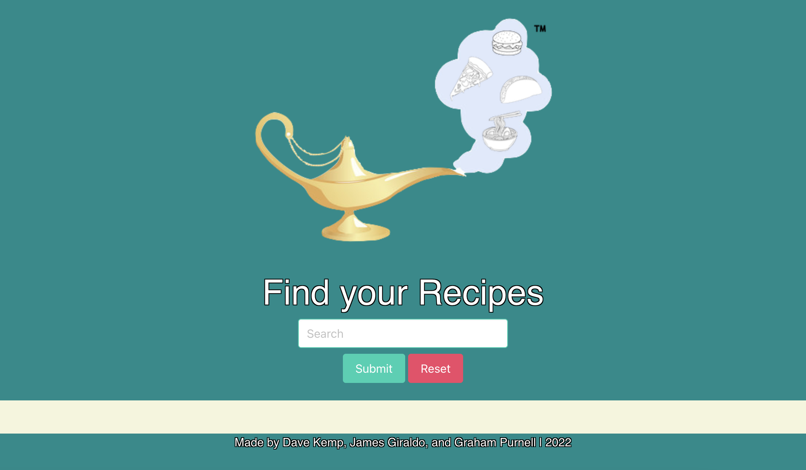

# Project 1: Food Genie

## Resources

- [LIVE SITE](https://N3330.github.io/wiki-artist/)

- [REPOSITORY](https://github.com/N3330/wiki-artist)

## Table of Contents

- [Resources](#resources)

- [Description](#description)

- [Visuals](#visuals)

- [Technologies Used](#technologies-used)

- [Authors and Acknowledgement](#authors-and-acknowledgement)

## Description

### User Story:
As a food enthusiast
I want to be able to easily search my favorite recipes and then be presented with that recipe and top video hits for that recipe
SO THAT I have the ability to see my favorite recipe and some helpful video in one spot.

### Acceptance Criteria:
GIVEN a recipe and video dashboard display

- WHEN I enter a recipe or food name on a landing page and search THEN I am shown a page with top youTube video links as well as recipes that match the search.
- When I am viewing the displayed information THEN I am given a dish name, steps to cook, ingredient's with quantities, and a picture of the prepared dish.
- When I am on the display page the UI is polished and interactive.

### Project Requirements

You and your group will use everything you’ve learned over the past six modules to create a real-world front-end application that you’ll be able to showcase to potential employers. The user story and acceptance criteria will depend on the project that you create, but your project must fulfil the following requirements:

- Use a CSS framework other than Bootstrap.
- Be deployed to GitHub Pages.
- Be interactive (i.e., accept and respond to user input).
- Use at least two [server-side APIs](https://coding-boot-camp.github.io/full-stack/apis/api-resources).
- Does not use alerts, confirms, or prompts (use modals).
- Use client-side storage to store persistent data.
- Be responsive.
- Have a polished UI.
- Have a clean repository that meets quality coding standards (file structure, naming conventions, follows best practices for class/id naming conventions, indentation, quality comments, etc.).
- Have a quality README (with unique name, description, technologies used, screenshot, and link to deployed application).

## Visuals
### Landing Page:

### Display Page:
|
|
|
### Presentation Slides:
|
|
|
## Technologies Used 
|
|
|
## Authors and Acknowledgement
Created by (in alphabetical order), James Giraldo, David Kemp, and Graham Purnell 